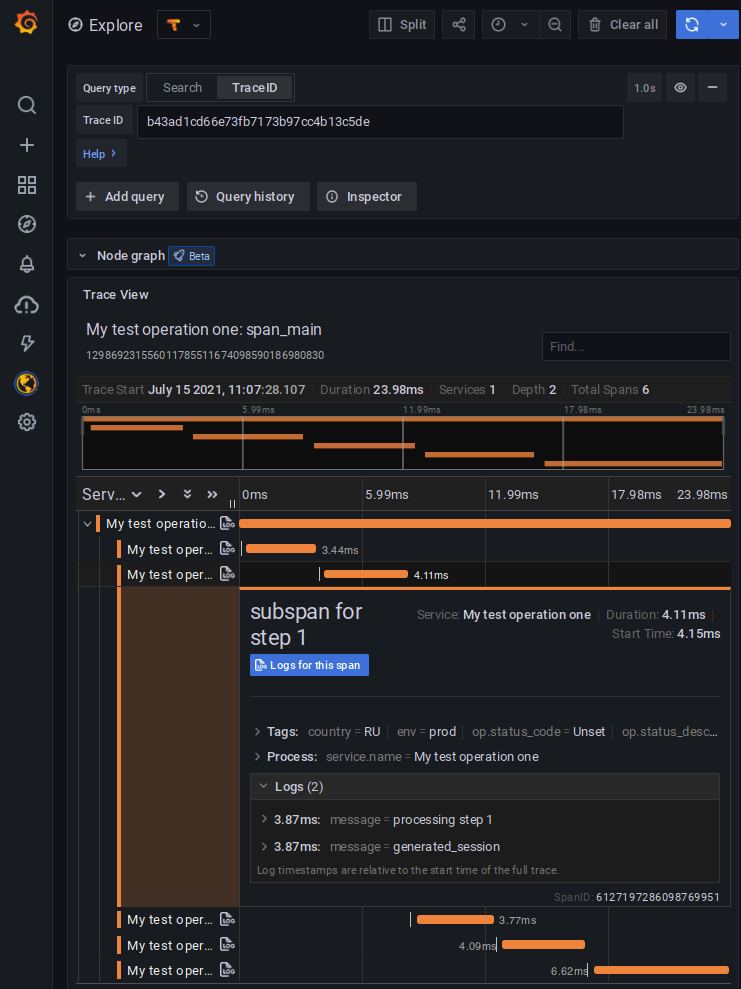

# Examples of PHP tracing implementation with uploading to Grafana Tempo

This is demo project with implementation of tracing in PHP application,
using OpenTelemetry API library, with uploading to Grafana Tempo via
Grafana Agent instance.

## Cloning and running
```
git clone https://github.com/MurzNN/grafana-tempo-tracing-examples-php.git
cd grafana-tempo-tracing-examples-php.git
composer install
php ./src/grafana-tempo-jaeger-example.php
```

Requirements:
- PHP 7.3 or above
- Composer

### Example of output:
```
Created AlwaysOnSampler with id 6230818d411270d350214548da794a4b
Starting My test operation one
Exporting root trace: b43ad1cd66e73fb7173b97cc4b13c5de, Span: c00e7394b9f8adab
Exporting subtrace step 0: Trace id: b43ad1cd66e73fb7173b97cc4b13c5de, Span: da44af06a4caae96, Parent: c00e7394b9f8adab
Exporting subtrace step 1: Trace id: b43ad1cd66e73fb7173b97cc4b13c5de, Span: 55082d77eaa7981f, Parent: c00e7394b9f8adab
Exporting subtrace step 2: Trace id: b43ad1cd66e73fb7173b97cc4b13c5de, Span: c967158ea72ff0eb, Parent: c00e7394b9f8adab
Exporting subtrace step 3: Trace id: b43ad1cd66e73fb7173b97cc4b13c5de, Span: d8940c1040ae38ac, Parent: c00e7394b9f8adab
Exporting subtrace step 4: Trace id: b43ad1cd66e73fb7173b97cc4b13c5de, Span: 54f4ff93540bc80f, Parent: c00e7394b9f8adab
My test operation one is completed!
```

After execution is completed, you can find that trace  in Grafana Explore web interface, using Tempo data source
by TraceID = `b43ad1cd66e73fb7173b97cc4b13c5de`.

It should looks like this:


Source code is based on OpenTelemetry PHP Library's [AlwaysOnJaegerExample.php](https://github.com/open-telemetry/opentelemetry-php/blob/main/examples/AlwaysOnJaegerExample.php) file.